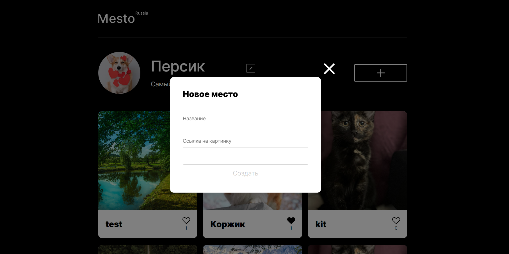
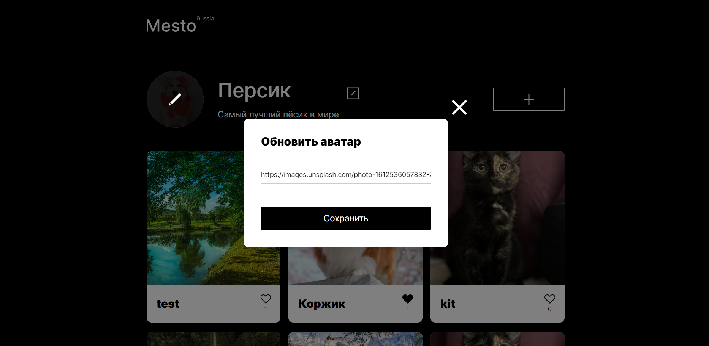
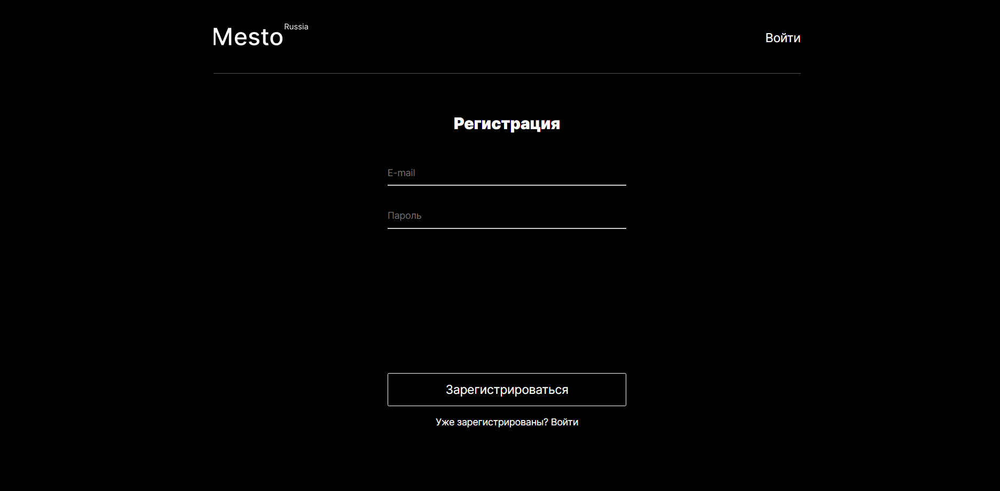
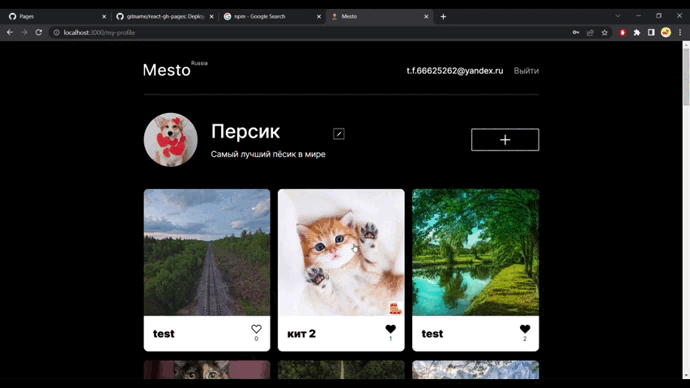

# Проект: Место

## Обзор

* Figma
* Сайт проекта
* Описание проекта
* Что использовалось?
* Как запустить?
* Доработка

## **Figma**

[Ссылка на макет в Figma](https://www.figma.com/file/2cn9N9jSkmxD84oJik7xL7/JavaScript.-Sprint-4?node-id=0%3A1)

## **Сайт проекта**

* [Ссылка на сайт](https://frantsuzovatamara.github.io/react-mesto-auth/)
* [Frontend](https://mesto.by.frantsuzova.t.p.nomoredomains.work)
* [Backend](https://api.mesto.by.frantsuzova.nomoredomains.work)

## **Описание проекта**

Репозиторий для приложения проекта `Mesto`, включающий фронтенд и бэкенд части приложения со следующими возможностями: авторизации и регистрации пользователей, операции с карточками и пользователями. Бэкенд расположите в директории `backend/`, а фронтенд - в `frontend/`.

Mesto - это интерактивная страница, на которой можно:

* делиться своими фотографиями и видеть фотографии других пользователей

* удалять свои карточки (у личных карточек есть иконка урны, у карточек других пользователей такой иконки нет), ставить лайки своим карточкам и карточкам других пользователей

* редактировать свой профиль

* менять аватар профиля

* регистрироваться, авторизовываться (при повторном входе авторизация не нужна) и выходить из профиля

## **Что использовалось?**

* HTML
* CSS
* Методология БЭМ
* JavaScript
* Create React App
* Хуки и классовые элементы
* JSX
* Webpack
* Api
* Node.js
* Express
* MongoDB
* Яндекс.Облако
* Postman

## **Как запустить?**

Подключить MongoDB, в папке /backend на 3000 порту запустить бэкенд приложения с помощью команды **npm run start**, в папке /frontend на 3001 порту запустить фронтенд командой **npm start**.

## **Доработка**

Для улучшения интерфейса можно также: 

* добавить возможность менять дизайн страницы
* добавлять помимо названий также автора той или иной карточки
* добавить возможность оставлять комментарии к карточкам
